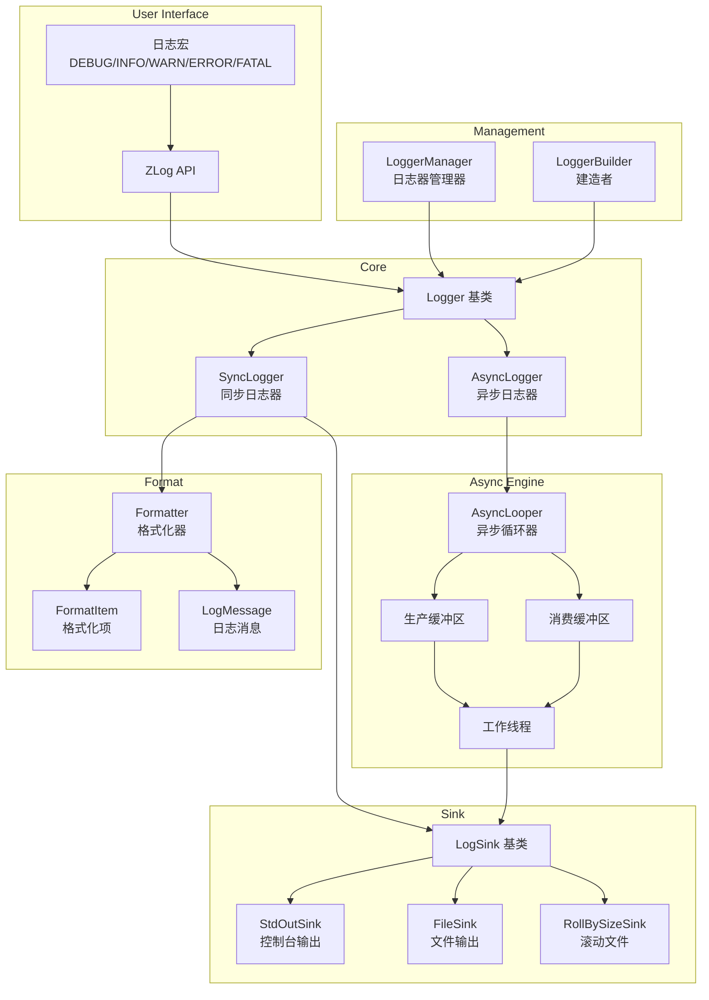
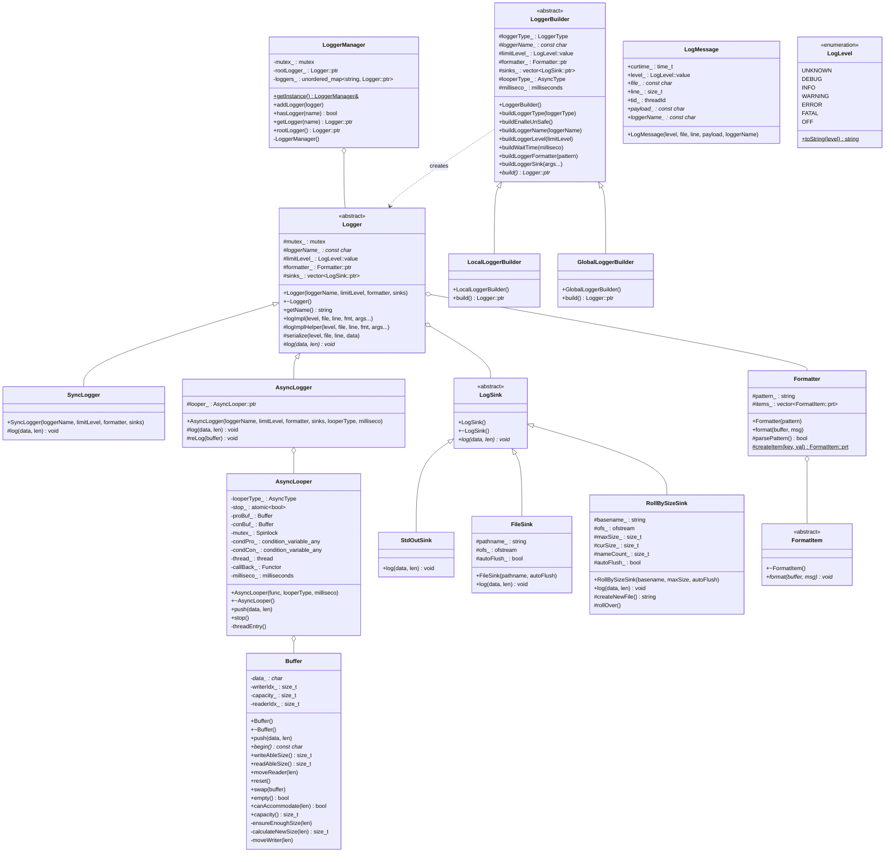
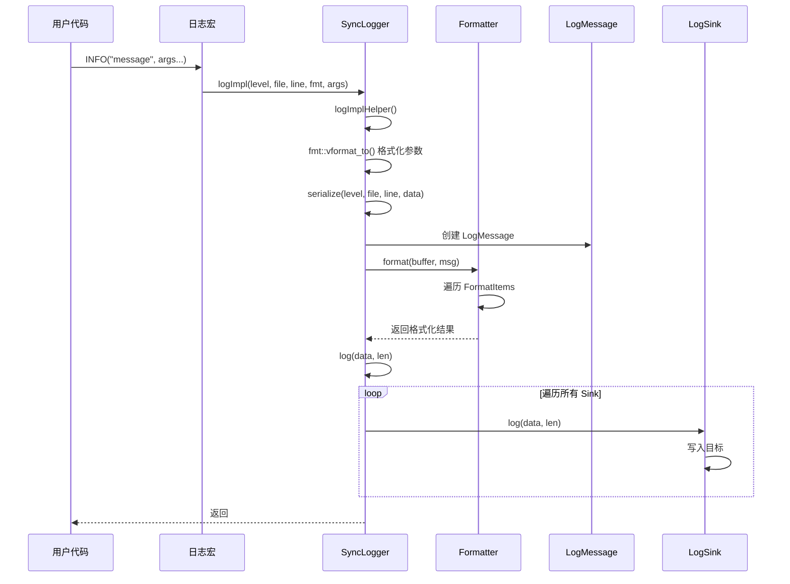
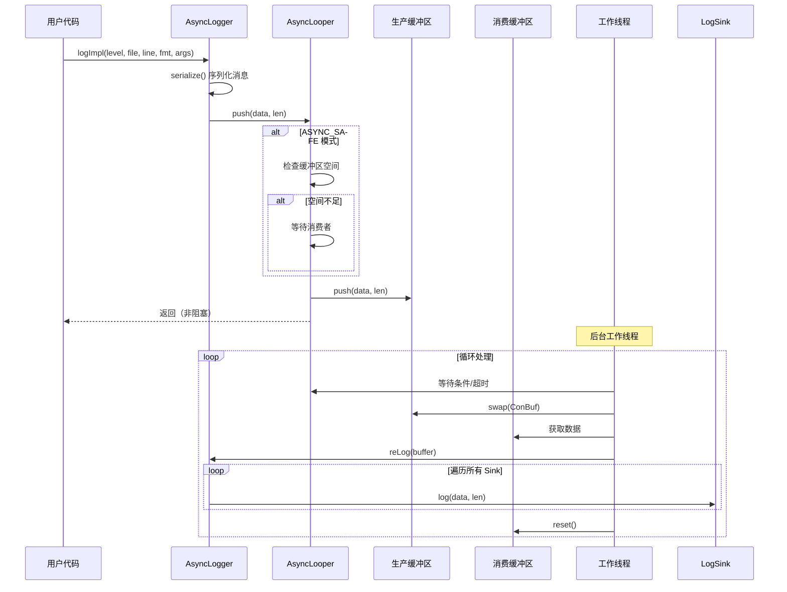

# ZLog

ZLog 是一个高性能、轻量级的 C++ 日志库，支持同步和异步两种日志模式。采用双缓冲区技术和生产者-消费者模式实现高效的异步日志，适用于对性能有较高要求的应用场景。

## 特性

- 同步/异步双模式支持
- 双缓冲区异步实现，减少锁竞争
- 多种日志落地方式（控制台、文件、滚动文件）
- 灵活的日志格式化
- 线程安全
- 建造者模式简化配置

## 编译依赖

| 依赖项 | 版本要求 | 说明 |
|--------|----------|------|
| CMake | >= 3.18 | 构建系统 |
| C++ 编译器 | C++11 | GCC 5+ / Clang 3.4+ |
| fmt | 任意版本 | 格式化库 |

### 编译方法

```bash
mkdir build && cd build
cmake ..
make -j$(nproc)
```

## 系统架构



## 核心类图



## 时序图

### 同步日志时序图



### 异步日志时序图



## 性能对比

基准测试环境说明：
- 测试环境：WSL2 Ubuntu24.04 12th Gen Intel(R) Core(TM) i5-12500H 8G Release
- 测试方式：每个测试持续3秒，统计总消息数和吞吐量
- 消息大小：32B / 64B / 128B / 256B / 512B
- 线程数：1 / 2 / 4 / 8 / 16
- 吞吐量计算：(总消息数 × 消息大小) / 测试时间 / 1024 / 1024

### 32 字节消息吞吐量对比 (MB/s)

| 线程数 | ZLog Sync | ZLog Async Safe | ZLog Async Unsafe | Spdlog Sync | Spdlog Async | Glog Sync |
|--------|-----------|-----------------|-------------------|-------------|--------------|----------|
| 1 | 55.34 | 548.85 | 516.04 | 336.92 | 88.57 | 15.51 |
| 2 | 32.61 | 281.49 | 284.40 | 148.19 | 3.22 | 9.69 |
| 4 | 15.27 | 156.97 | 152.31 | 97.90 | 2.03 | 7.45 |
| 8 | 11.01 | 138.10 | 117.62 | 72.17 | 2.52 | 3.76 |
| 16 | 10.64 | 134.32 | 167.52 | 53.23 | 2.70 | 3.00 |

### 128 字节消息吞吐量对比 (MB/s)

| 线程数 | ZLog Sync | ZLog Async Safe | ZLog Async Unsafe | Spdlog Sync | Spdlog Async | Glog Sync |
|--------|-----------|-----------------|-------------------|-------------|--------------|----------|
| 1 | 193.24 | 1320.49 | 1044.15 | 801.51 | 325.56 | 55.36 |
| 2 | 95.18 | 873.64 | 1039.50 | 354.90 | 9.39 | 37.99 |
| 4 | 58.50 | 618.96 | 568.16 | 267.88 | 8.89 | 29.45 |
| 8 | 42.58 | 723.59 | 522.14 | 184.82 | 9.68 | 14.03 |
| 16 | 41.59 | 788.98 | 663.75 | 146.82 | 10.85 | 11.62 |

### 256 字节消息吞吐量对比 (MB/s)

| 线程数 | ZLog Sync | ZLog Async Safe | ZLog Async Unsafe | Spdlog Sync | Spdlog Async | Glog Sync |
|--------|-----------|-----------------|-------------------|-------------|--------------|----------|
| 1 | 348.32 | 953.39 | 1131.26 | 954.04 | 344.21 | 106.36 |
| 2 | 155.80 | 871.48 | 1046.92 | 464.24 | 20.93 | 69.46 |
| 4 | 106.57 | 824.57 | 967.79 | 326.10 | 15.76 | 58.53 |
| 8 | 80.74 | 708.85 | 933.20 | 223.86 | 18.80 | 29.14 |
| 16 | 76.44 | 918.20 | 486.71 | 173.77 | 21.00 | 22.66 |

### 512 字节消息吞吐量对比 (MB/s)

| 线程数 | ZLog Sync | ZLog Async Safe | ZLog Async Unsafe | Spdlog Sync | Spdlog Async | Glog Sync |
|--------|-----------|-----------------|-------------------|-------------|--------------|----------|
| 1 | 436.42 | 1002.09 | 1007.69 | 1093.00 | 542.94 | 201.48 |
| 2 | 184.76 | 1243.12 | 814.90 | 554.33 | 28.26 | 122.58 |
| 4 | 144.29 | 1160.68 | 729.12 | 396.25 | 31.00 | 109.59 |
| 8 | 125.00 | 1083.37 | 652.50 | 266.98 | 36.72 | 57.56 |
| 16 | 120.66 | 811.54 | 534.71 | 223.27 | 40.81 | 45.05 |

### 性能分析

1. **同步模式性能**：
   - **Spdlog Sync** 在同步模式下整体吞吐量最高，单线程可达数百 MB/s，消息越大优势越明显。
   - **ZLog Sync** 在小消息场景下吞吐量相对较低，但随消息大小增加和线程增多，性能可提升到数百 MB/s 量级。
   - **Glog Sync** 整体性能最低，在各种消息大小和线程数下都明显落后于 ZLog 和 Spdlog。

2. **异步模式性能**：
   - **ZLog Async Safe/Unsafe** 在异步模式下表现优异，尤其在大消息场景下，单线程和多线程下都能达到较高吞吐量（约 1 GB/s 量级）。
   - **ZLog Async Unsafe** 在部分场景下吞吐量略高于 Safe 模式，但需要权衡,unsafe可能会不断占用更多的内存空间。
   - **Spdlog Async** 在多线程场景下吞吐量明显低于 ZLog Async 和 Spdlog Sync，存在明显瓶颈。

3. **多线程扩展性**：
   - **ZLog Async** 多线程扩展性整体良好，在 2～16 线程下大多数消息大小场景中都能保持较高吞吐量，部分场景随线程数增加仍有明显提升。
   - **Spdlog Sync** 多线程扩展性较好，但同步写入磁盘带来的锁与 IO 延迟限制了吞吐量上限。
   - **Spdlog Async** 多线程扩展性较差，线程池与队列在高并发下容易成为瓶颈。

4. **使用建议**：
   - 对于**小消息、同步场景**：推荐 Spdlog Sync
   - 对于**大消息、异步场景**：推荐 ZLog Async（Safe/Unsafe）

## 快速开始

```cpp
#include "zlog.h"

int main() {
    // 使用默认 root 日志器
    INFO("Hello, {}!", "ZLog");
    
    // 创建自定义异步日志器
    zlog::GlobalLoggerBuilder builder;
    builder.buildLoggerName("async_logger");
    builder.buildLoggerType(zlog::LoggerType::LOGGER_ASYNC);
    builder.buildLoggerLevel(zlog::LogLevel::value::DEBUG);
    builder.buildLoggerFormatter("[%d{%H:%M:%S}][%p]%T%m%n");
    builder.buildLoggerSink<zlog::FileSink>("./logs/app.log");
    builder.build();
    
    auto logger = zlog::getLogger("async_logger");
    logger->ZLOG_INFO("Async logging: {}", 42);
    
    return 0;
}
```

## 格式化字符串

| 占位符 | 说明 |
|--------|------|
| `%d{format}` | 时间，format 为 strftime 格式 |
| `%t` | 线程 ID |
| `%c` | 日志器名称 |
| `%f` | 源文件名 |
| `%l` | 行号 |
| `%p` | 日志级别 |
| `%T` | 制表符 |
| `%m` | 日志消息 |
| `%n` | 换行符 |

## License

MIT License
